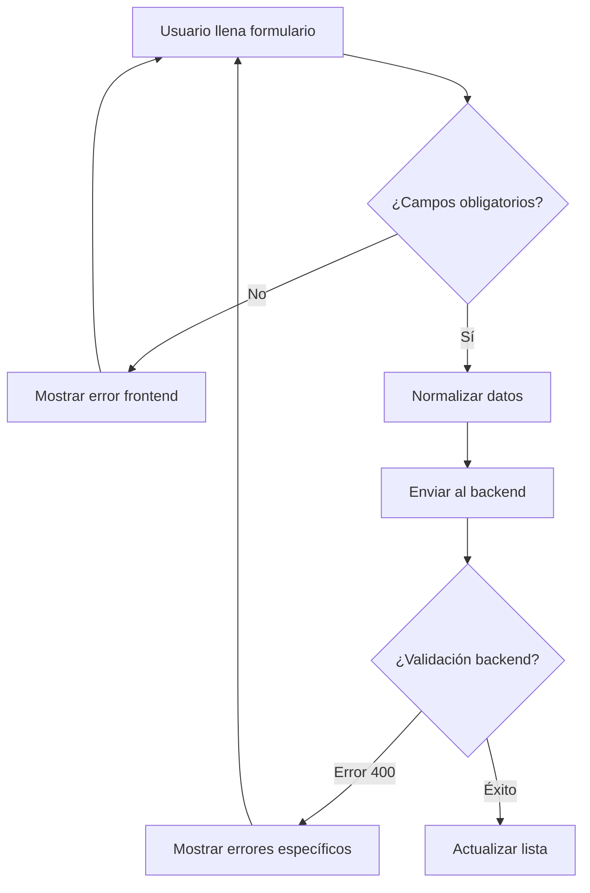

# Actualización - Campo Código Obligatorio en Customers

## 🔧 Cambios Implementados

### Frontend - Customers.jsx

#### 1. **Campo Código Obligatorio**
- ✅ Agregado atributo `required` al input de código
- ✅ Transformación automática a mayúsculas (`textTransform: 'uppercase'`)
- ✅ Validación frontend antes de enviar al backend

#### 2. **Labels Informativos**
- ✅ Agregadas etiquetas descriptivas para todos los campos
- ✅ Indicadores visuales `*` para campos obligatorios:
  - **Nombre** *
  - **Email** *
  - **Código** *
  - **Tipo de Cliente** *

#### 3. **Validación Mejorada**
```javascript
// Validaciones frontend
if (!form.name.trim()) {
    setError('El nombre del cliente es obligatorio');
    return;
}
if (!form.code.trim()) {
    setError('El código del cliente es obligatorio');
    return;
}
if (!form.email.trim()) {
    setError('El email del cliente es obligatorio');
    return;
}
```

#### 4. **Normalización de Datos**
```javascript
const submitData = {
    name: form.name.trim(),
    email: form.email.trim().toLowerCase(),
    code: form.code.trim().toUpperCase(),
    // ... otros campos
};
```

#### 5. **Manejo de Errores Mejorado**
- ✅ Detección específica de errores 400 del backend
- ✅ Mapeo de errores por campo con mensajes claros
- ✅ Formato visual mejorado con iconos y estructura

#### 6. **UI/UX Improvements**
- ✅ Header informativo en el formulario
- ✅ Placeholders más descriptivos
- ✅ Tipo de input `email` para validación automática
- ✅ Select actualizado con información de descuentos

## 📝 Nuevos Placeholders y Labels

| Campo | Label | Placeholder | Requerido |
|-------|-------|-------------|-----------|
| Nombre | Nombre * | "Nombre del cliente" | ✅ |
| Email | Email * | "cliente@email.com" | ✅ |
| Teléfono | Teléfono | "123-456-7890" | ❌ |
| Dirección | Dirección | "Dirección del cliente" | ❌ |
| Código | Código * | "CLI001" | ✅ |
| Tipo Cliente | Tipo de Cliente * | Select con opciones | ✅ |

## 🎯 Validaciones Implementadas

### Frontend (JavaScript)
1. **Campos no vacíos**: nombre, código, email
2. **Formato email**: usando `type="email"`
3. **Normalización**: código → MAYÚS, email → minús

### Backend (Django - ya implementado)
1. **Códigos únicos**: validación de duplicados
2. **Emails únicos**: validación de duplicados
3. **Customer type válido**: FK existente
4. **Business assignment**: automático por usuario

## 🚨 Mensajes de Error

### Frontend
```
Error de validación:
• Código: Ya existe un cliente con este código. Por favor, use un código diferente.
• Email: Ya existe un cliente con este email. Por favor, use un email diferente.
• Nombre: El nombre del cliente es obligatorio.
• Tipo de cliente: El tipo de cliente es obligatorio.
```

### Casos Comunes
1. **Código duplicado** → "Ya existe un cliente con este código..."
2. **Email duplicado** → "Ya existe un cliente con este email..."
3. **Campos vacíos** → "El [campo] del cliente es obligatorio"

## 🔄 Flujo de Validación



## 🎨 Cambios Visuales

### Antes
- Campos sin etiquetas
- Sin indicadores de obligatoriedad
- Errores genéricos

### Después
- ✅ Labels descriptivos con *
- ✅ Header informativo
- ✅ Placeholders claros
- ✅ Errores específicos por campo
- ✅ Transformación visual de datos

## 📱 Responsividad

Los cambios mantienen la estructura responsive existente:
- `col-md-4`, `col-md-3`, `col-md-2` para diferentes tamaños
- Formulario adaptable en móviles
- Botones y campos optimizados

---

**✅ Actualización completada**  
**🚀 Lista para testing y deploy**
